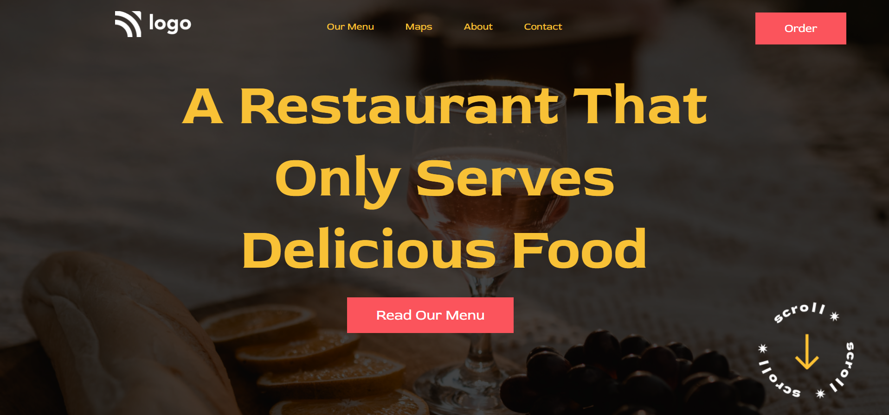

# Project 2 - HTML and CSS

By Piyush

Deployed link of Website &nbsp; 

 

# [Link to Project 2](https://restaurant-menu-project2.netlify.app/)

 

# Preview of the Project.

 

## What I learnt from this project?

- I learnt **opacity** and how we can apply opacity to an background.
- I also learnt about this amazing **font RED ROSE**.
- I also learnt about **nav** and how we can make a navbar for websites.

 

# Time Taken to completed this project is 1 hour.